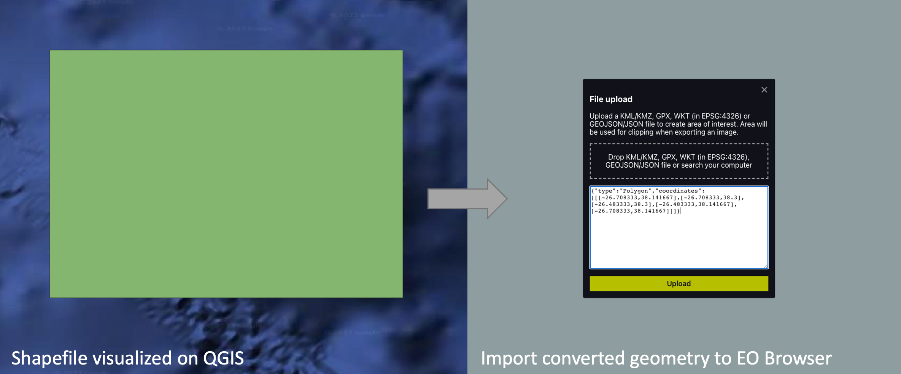
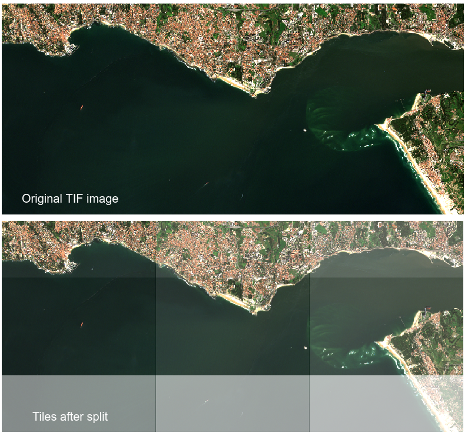

# EO_Tools
Earth Observation Tools

Includes:
 - **shp_to_dic**: Convert your shapefiles 2D polygons to dictionaries with coordinates, useful for using with SentinelHub EOBrowser, POS2IDON pipeline, and other applications;
 

- **split_into_tiles**: Split your TIF image into smaller tiles with overlap, useful for using with POS2IDON pipeline, Machine Learning, and other applications;
 

